# 分布式任务调度系统设计说明书

## 1. 系统概述

### 1.1 设计目标

本系统旨在提供一个高可用、可扩展的分布式任务调度平台，支持大规模任务的调度、执行和监控。系统具备以下特点：

- 高可靠性：保证任务的可靠执行，支持失败重试
- 高可用性：无单点故障，支持水平扩展
- 灵活性：支持多种任务类型和调度策略
- 可观测性：提供完善的监控和日志功能

### 1.2 应用场景

- 批处理作业调度
- 定时数据处理
- 系统维护任务
- 分布式计算任务协调
- ETL数据处理流程

### 1.3 系统架构

系统采用Master-Worker架构，主要包含以下组件：

1. **调度器(Scheduler)**：系统的核心组件，负责任务的调度和分发
2. **执行器(Executor)**：负责接收并执行具体任务
3. **存储层**：MySQL数据库，存储任务定义和执行记录
4. **消息队列**：Kafka，用于任务分发和结果回传
5. **协调服务**：ZooKeeper，用于服务发现和协调
6. **Web UI**：提供用户界面，用于任务管理和系统监控

## 2. 系统架构设计

### 2.1 总体架构

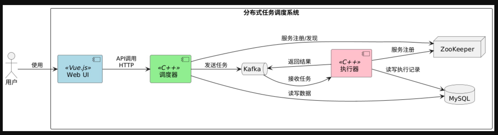

### 2.2 组件详细设计

#### 2.2.1 调度器(Scheduler)

调度器是系统的核心组件，主要职责包括：

- 任务调度：根据任务定义和调度策略，决定何时执行任务
- 执行器管理：维护执行器的注册信息，监控执行器状态
- 任务分发：将任务分发给合适的执行器
- 结果处理：处理任务执行结果，更新任务状态
- 提供API：供Web UI和外部系统调用

#### 2.2.2 执行器(Executor)

执行器负责具体任务的执行，主要职责包括：

- 任务执行：接收并执行分配的任务
- 状态报告：向调度器报告任务执行状态和结果
- 资源管理：管理本地资源，确保任务正常执行
- 心跳维护：定期向调度器发送心跳，表明自己处于活动状态

#### 2.2.3 存储层

使用MySQL数据库存储系统数据，主要包括：

- 任务定义：任务的基本信息、调度规则等
- 执行记录：任务的执行历史、状态和结果
- 执行器信息：执行器的注册信息和状态

#### 2.2.4 消息队列

使用Kafka作为消息队列，主要用于：

- 任务分发：调度器通过Kafka将任务分发给执行器
- 结果回传：执行器通过Kafka将执行结果回传给调度器
- 解耦组件：降低系统组件间的耦合度

#### 2.2.5 协调服务

使用ZooKeeper作为协调服务，主要用于：

- 服务发现：执行器向ZooKeeper注册，调度器从ZooKeeper获取执行器信息
- 分布式锁：确保某些操作的互斥性
- 配置管理：集中管理系统配置

#### 2.2.6 Web UI

提供用户界面，主要功能包括：

- 任务管理：创建、修改、删除任务
- 执行器管理：查看执行器状态，管理执行器
- 系统监控：监控系统运行状态，查看任务执行情况
- 日志查看：查看任务执行日志

## 3. 详细设计

### 3.1 类图

#### 总体

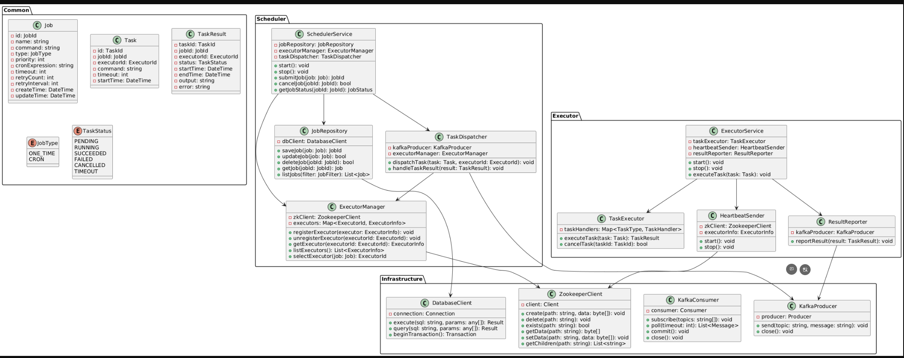

#### Common

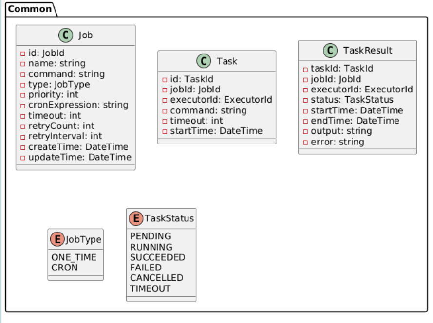

#### Scheduler

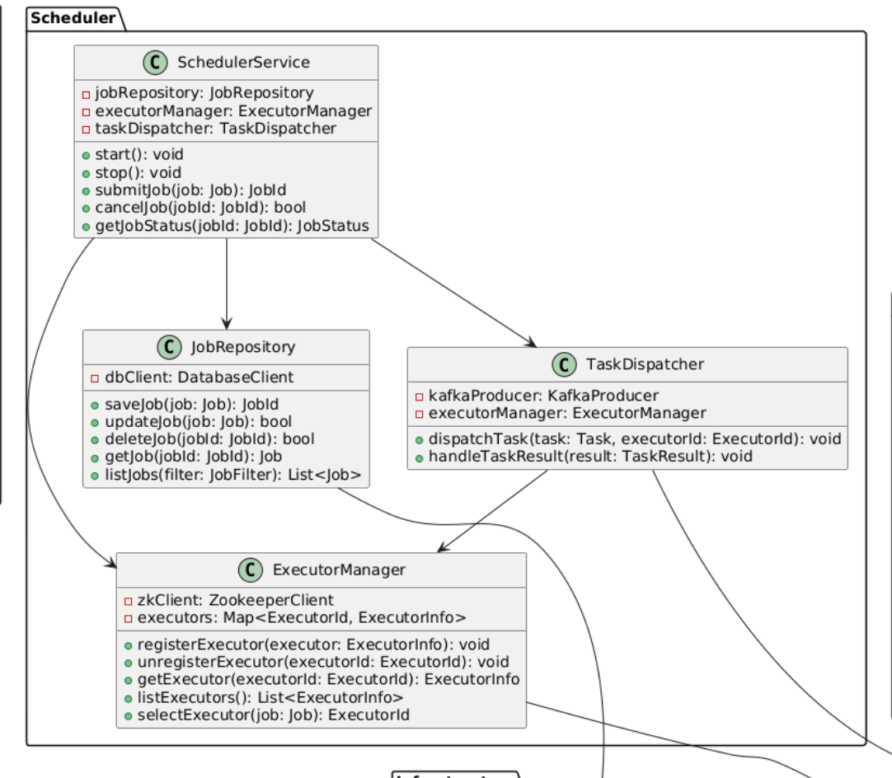


#### Executor

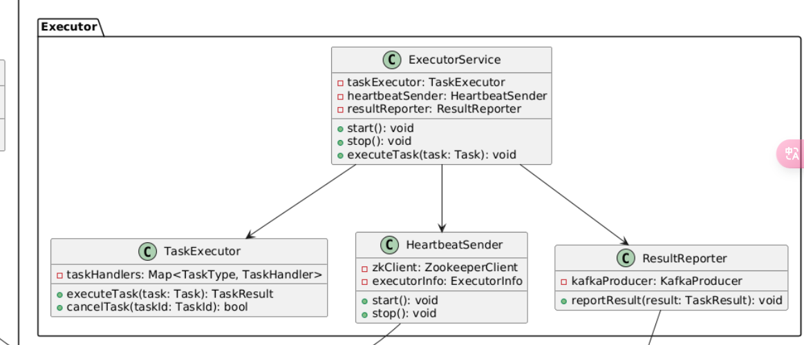

#### 中间件

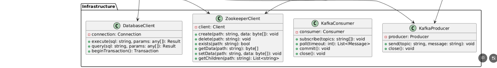


### 3.2 数据库设计

#### 3.2.1 jobs表

```sql
CREATE TABLE jobs (
    job_id VARCHAR(64) PRIMARY KEY,
    name VARCHAR(255) NOT NULL,
    command TEXT NOT NULL,
    type TINYINT NOT NULL,
    priority INT DEFAULT 0,
    cron_expression VARCHAR(100),
    timeout INT DEFAULT 0,
    retry_count INT DEFAULT 0,
    retry_interval INT DEFAULT 0,
    create_time DATETIME DEFAULT CURRENT_TIMESTAMP,
    update_time DATETIME DEFAULT CURRENT_TIMESTAMP ON UPDATE CURRENT_TIMESTAMP
);
```

#### 3.2.2 job_logs表

```sql
CREATE TABLE job_logs (
    id BIGINT AUTO_INCREMENT PRIMARY KEY,
    job_id VARCHAR(64) NOT NULL,
    executor_id VARCHAR(64) NOT NULL,
    status TINYINT NOT NULL,
    start_time DATETIME NOT NULL,
    end_time DATETIME,
    output TEXT,
    error TEXT,
    INDEX idx_job_id (job_id),
    INDEX idx_start_time (start_time)
);
```

#### 3.2.3 executors表

```sql
CREATE TABLE executors (
    executor_id VARCHAR(64) PRIMARY KEY,
    host VARCHAR(255) NOT NULL,
    port INT NOT NULL,
    status TINYINT NOT NULL,
    last_heartbeat_time DATETIME NOT NULL,
    register_time DATETIME NOT NULL,
    INDEX idx_status (status)
);
```

### 3.3 活动图

#### 3.3.1 任务调度流程

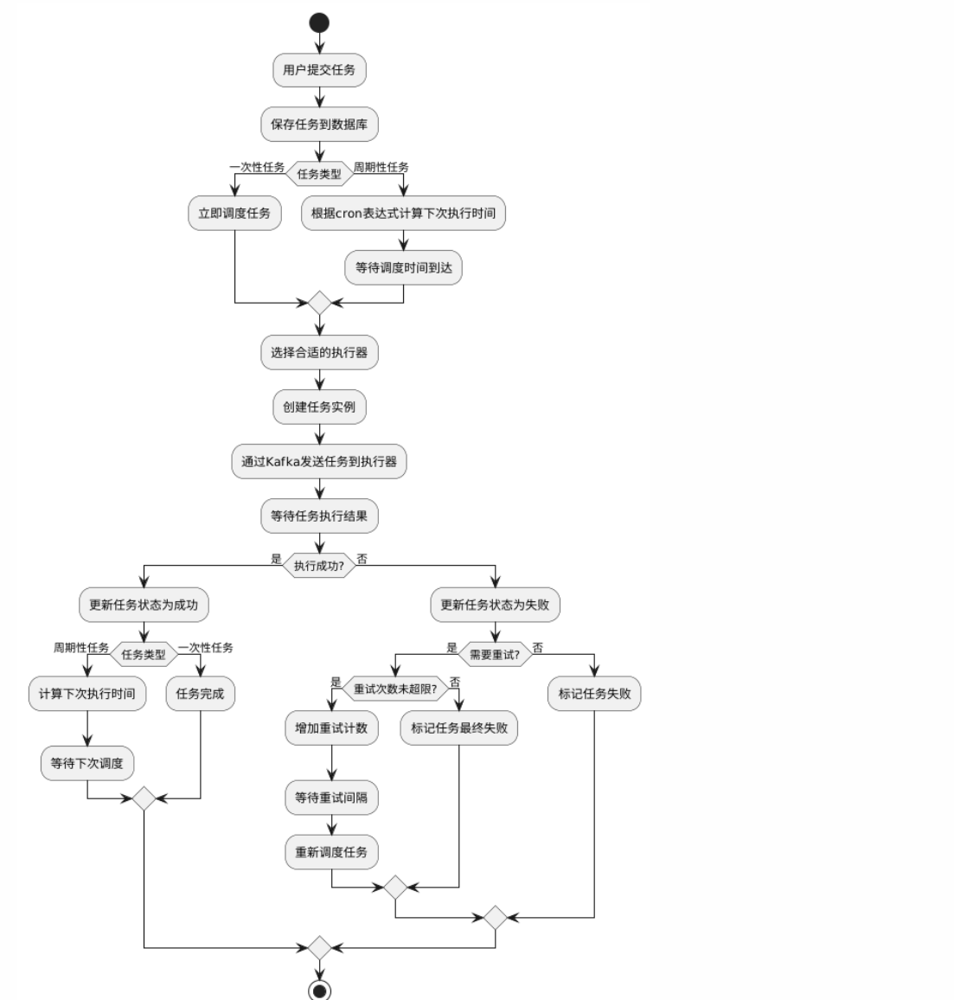


#### 3.3.2 执行器注册流程

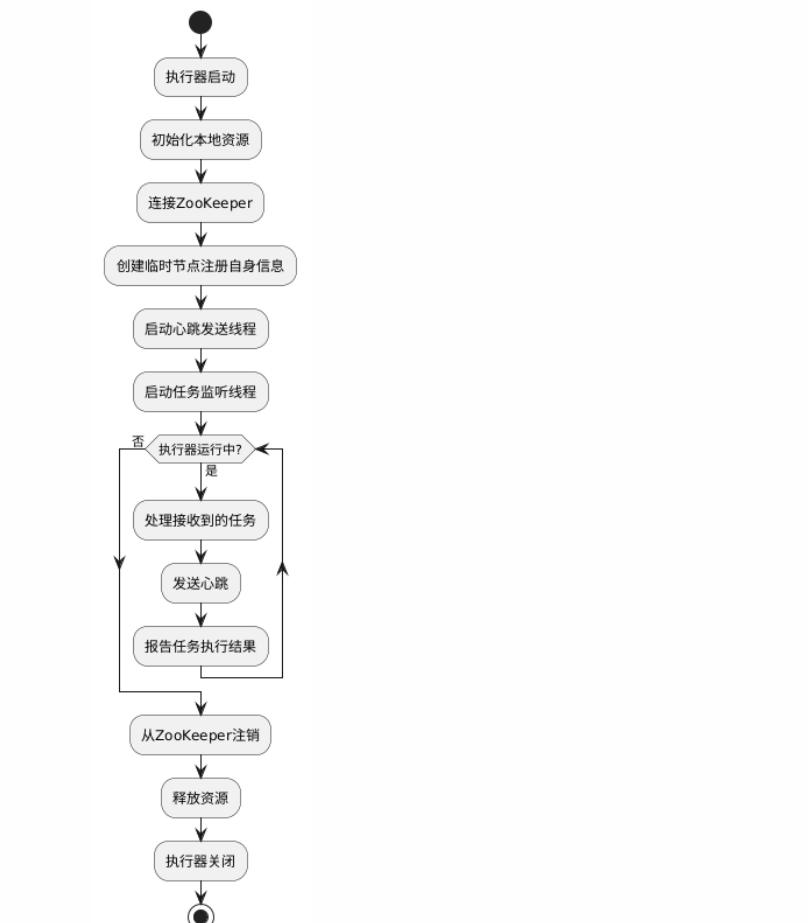

### 3.4 数据流图

#### 3.4.1 系统数据流图

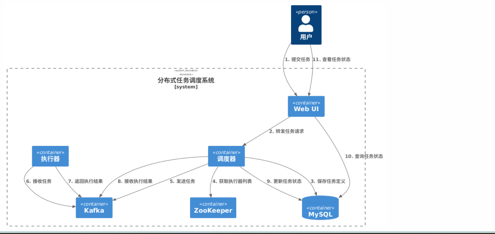

### 3.5 用例图

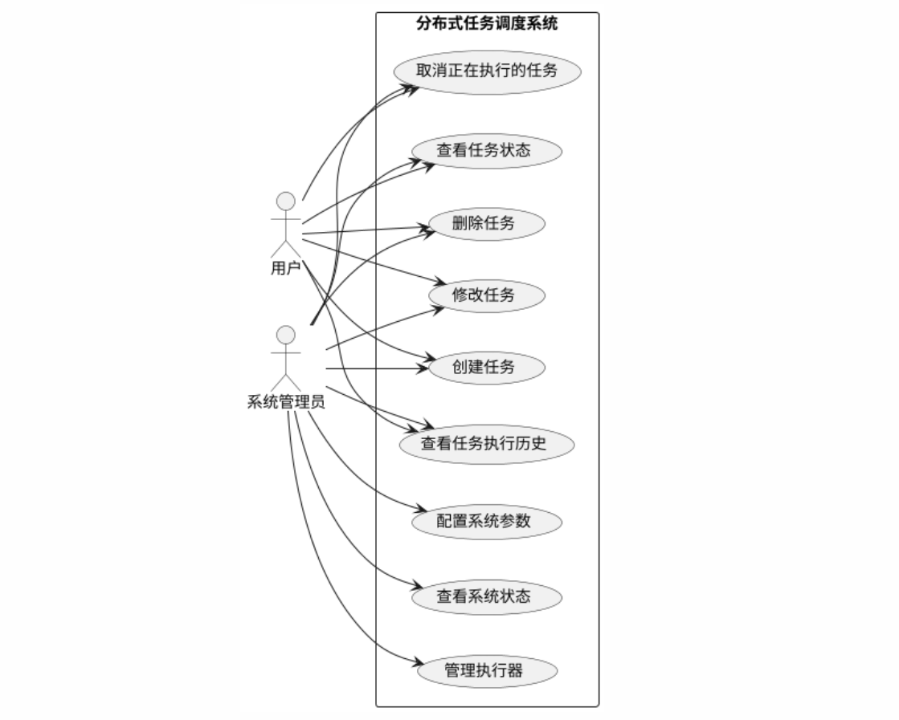


### 3.6 时序图

#### 3.6.1 任务提交和执行时序图

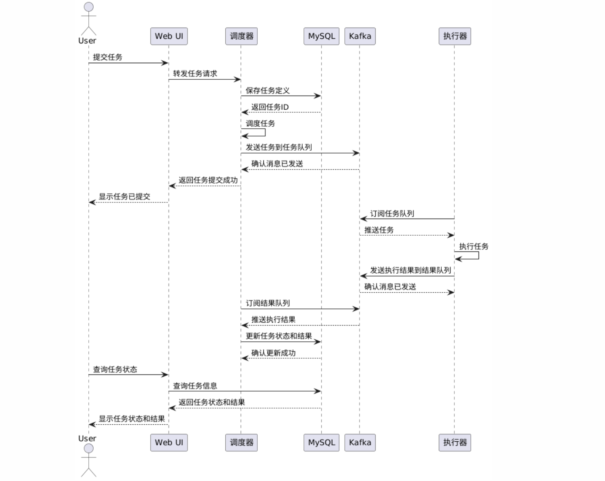

#### 3.6.2 执行器注册和心跳时序图

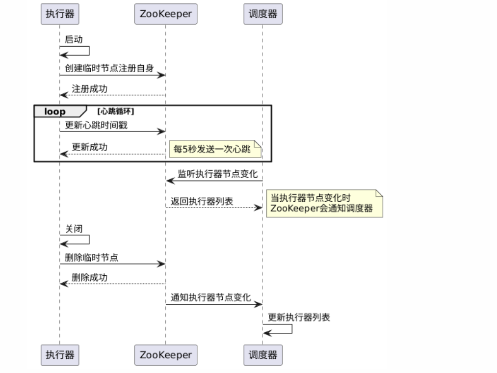


### 调度器调度流程

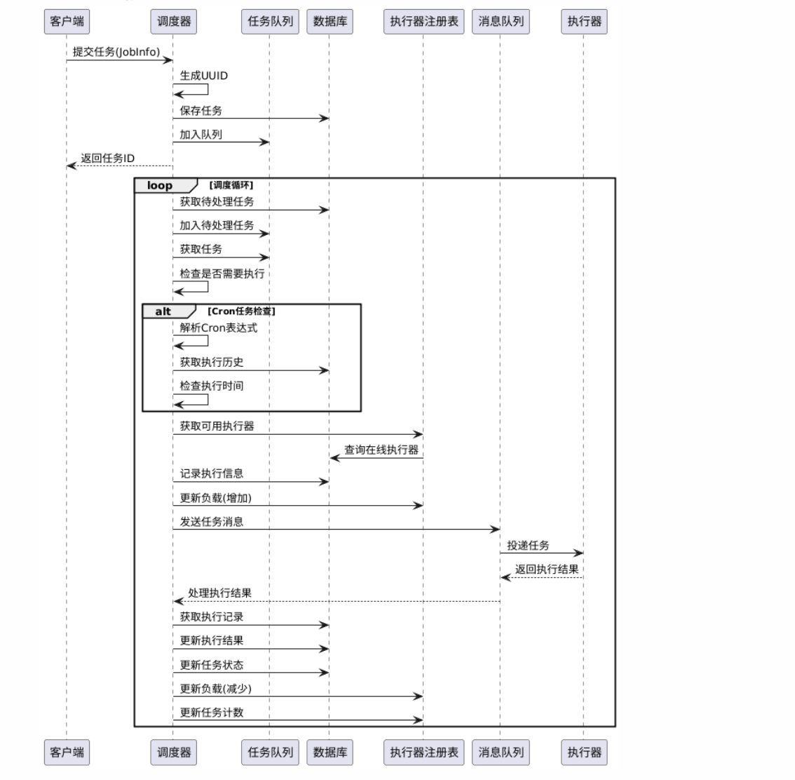


## 4. 接口设计

### 4.1 API接口

#### 4.1.1 任务管理接口

| 接口名称 | 请求方法 | 接口路径 | 描述 |
|---------|---------|---------|------|
| 创建任务 | POST | /api/jobs | 创建新任务 |
| 修改任务 | PUT | /api/jobs/{jobId} | 修改现有任务 |
| 删除任务 | DELETE | /api/jobs/{jobId} | 删除任务 |
| 获取任务详情 | GET | /api/jobs/{jobId} | 获取任务详细信息 |
| 获取任务列表 | GET | /api/jobs | 获取任务列表 |
| 取消任务 | POST | /api/jobs/{jobId}/cancel | 取消正在执行的任务 |
| 立即执行任务 | POST | /api/jobs/{jobId}/execute | 立即执行任务 |
| 获取任务执行历史 | GET | /api/jobs/{jobId}/history | 获取任务执行历史 |

#### 4.1.2 执行器管理接口

| 接口名称 | 请求方法 | 接口路径 | 描述 |
|---------|---------|---------|------|
| 获取执行器列表 | GET | /api/executors | 获取执行器列表 |
| 获取执行器详情 | GET | /api/executors/{executorId} | 获取执行器详细信息 |
| 禁用执行器 | POST | /api/executors/{executorId}/disable | 禁用执行器 |
| 启用执行器 | POST | /api/executors/{executorId}/enable | 启用执行器 |

#### 4.1.3 系统管理接口

| 接口名称 | 请求方法 | 接口路径 | 描述 |
|---------|---------|---------|------|
| 获取系统状态 | GET | /api/system/status | 获取系统运行状态 |
| 获取系统配置 | GET | /api/system/config | 获取系统配置 |
| 更新系统配置 | PUT | /api/system/config | 更新系统配置 |

### 4.2 消息格式

#### 4.2.1 任务消息

```json
{
  "task_id": "task-123456",
  "job_id": "job-123456",
  "command": "echo 'Hello World'",
  "timeout": 3600,
  "retry_count": 3,
  "retry_interval": 60,
  "priority": 10,
  "create_time": "2023-01-01T12:00:00Z"
}
```

#### 4.2.2 结果消息

```json
{
  "task_id": "task-123456",
  "job_id": "job-123456",
  "executor_id": "executor-123456",
  "status": 1,
  "start_time": "2023-01-01T12:00:00Z",
  "end_time": "2023-01-01T12:01:00Z",
  "output": "Hello World",
  "error": "",
  "exit_code": 0
}
```

## 5. 安全设计

### 5.1 认证与授权

系统采用基于角色的访问控制(RBAC)模型，主要角色包括：

- 管理员：拥有所有权限
- 普通用户：只能管理自己创建的任务
- 只读用户：只能查看任务状态和执行历史

所有API请求都需要通过JWT token进行认证，token中包含用户ID和角色信息。

### 5.2 数据安全

- 敏感数据加密存储
- 数据库访问权限控制
- 定期数据备份
- 传输数据加密(HTTPS/TLS)

### 5.3 网络安全

- 防火墙配置
- 限制API访问频率
- 日志审计
- 定期安全扫描

## 6. 性能与可扩展性

### 6.1 性能优化

- 数据库索引优化
- 连接池管理
- 任务批量处理
- 缓存机制

### 6.2 可扩展性设计

- 调度器集群：支持多个调度器实例，通过ZooKeeper协调
- 执行器水平扩展：可以动态增加执行器节点
- 数据库分库分表：支持数据库水平扩展
- 消息队列分区：Kafka主题分区，提高并行处理能力

## 7. 监控与运维

### 7.1 监控指标

- 系统级指标：CPU、内存、磁盘、网络
- 应用级指标：请求延迟、吞吐量、错误率
- 业务级指标：任务成功率、平均执行时间、队列长度

### 7.2 日志管理

- 应用日志：记录系统运行状态和错误信息
- 审计日志：记录用户操作和系统变更
- 任务日志：记录任务执行过程和结果

### 7.3 告警机制

- 阈值告警：当监控指标超过阈值时触发告警
- 异常告警：当系统出现异常时触发告警
- 任务失败告警：当重要任务执行失败时触发告警

## 8. 部署方案

### 8.1 Docker部署

系统支持使用Docker和Docker Compose进行容器化部署，详见[Docker部署指南](../README-Docker.md)。

### 8.2 本地部署

系统也支持在本地环境直接部署，详见[本地部署指南](../README-Local.md)。


==推荐使用本地部署；Docker compose中的容器依赖了很多第三方库，由于众所周知的网络原因，拉取不了，且国内封了一大批docker 代理，速度较慢==

## 9. 测试策略

### 9.1 单元测试

使用Google Test框架进行单元测试，覆盖核心组件和关键功能。

### 9.2 集成测试

测试组件间的交互，确保系统各部分能够正常协作。

### 9.3 性能测试

测试系统在高负载下的表现，包括：

- 并发任务处理能力
- 大规模任务调度性能
- 系统资源使用情况

### 9.4 故障恢复测试

测试系统在各种故障情况下的恢复能力，包括：

- 执行器故障
- 调度器故障
- 数据库故障
- 网络故障

## 10. 未来规划

### 10.1 功能增强

- 支持更多任务类型
- 任务依赖关系管理
- 任务流水线
- 更丰富的调度策略

### 10.2 性能优化

- 调度算法优化
- 资源使用效率提升
- 数据库查询优化

### 10.3 可用性提升

- 多区域部署
- 灾备方案
- 自动扩缩容 