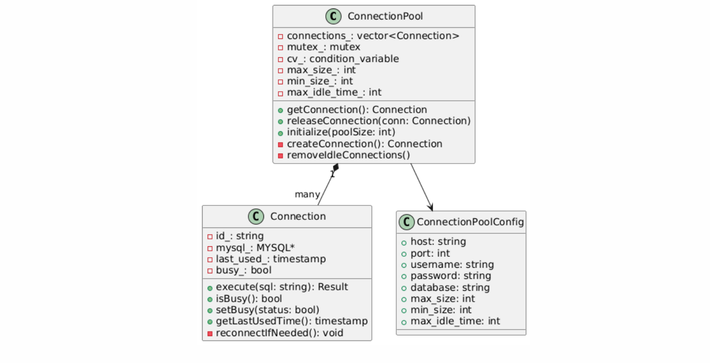

# Web层设计文档

## 1. 概述

本文档描述了分布式任务调度系统的Web层设计。系统使用cpp-httplib库实现HTTP服务器，采用前后端分离架构。后端基于C++17开发RESTful API，前端使用Vue 3 + TypeScript + Element Plus构建用户界面。

### 1.1 技术栈
- 后端：
  - cpp-httplib v0.12.0：HTTP服务器实现
  - nlohmann-json v3.11.2：JSON序列化/反序列化
  - spdlog v1.12.0：日志记录
  
- 前端：
  - Vue 3.3：前端框架
  - TypeScript 5.0：类型系统
  - Element Plus 2.3：UI组件库
  - ECharts 5.4：图表可视化
  - Axios：HTTP客户端

## 2. 架构设计

### 2.1 整体架构


### 2.2 类图


### 2.3 序列图


## 3. API设计

### 3.1 RESTful API接口

#### 任务管理API
| 方法   | 路径                         | 描述         | 请求体示例                           | 响应体示例                                            |
| ------ | ---------------------------- | ------------ | ------------------------------------ | ----------------------------------------------------- |
| GET    | /api/jobs                    | 获取任务列表 | N/A                                  | `{"code":0, "data":[{"job_id":"123","name":"test"}]}` |
| POST   | /api/jobs                    | 创建新任务   | `{"name":"job1","command":"echo 1"}` | `{"code":0, "data":{"job_id":"123"}}`                 |
| GET    | /api/jobs/{jobId}            | 获取任务详情 | N/A                                  | `{"code":0, "data":{"job_id":"123","status":1}}`      |
| PUT    | /api/jobs/{jobId}            | 更新任务     | `{"name":"new_name"}`                | `{"code":0, "message":"success"}`                     |
| DELETE | /api/jobs/{jobId}            | 删除任务     | N/A                                  | `{"code":0, "message":"success"}`                     |
| POST   | /api/jobs/{jobId}/execute    | 执行任务     | `{"params":{"arg1":"val1"}}`         | `{"code":0, "data":{"execution_id":"456"}}`           |
| GET    | /api/jobs/{jobId}/executions | 获取执行历史 | N/A                                  | `{"code":0, "data":[{"id":"1","status":2}]}`          |


## 4. 安全设计

### 4.1 认证与授权


### 4.2 权限配置示例
```json
{
    "ADMIN": {
        "jobs": ["create", "read", "update", "delete", "execute"],
        "executors": ["read", "update"],
        "stats": ["read", "reset"]
    },
    "USER": {
        "jobs": ["create", "read", "update", "delete"],
        "executors": ["read"],
        "stats": ["read"]
    },
    "READONLY": {
        "jobs": ["read"],
        "executors": ["read"],
        "stats": ["read"]
    }
}
```

### 4.3 JWT Token结构
```json
{
    "header": {
        "alg": "HS256",
        "typ": "JWT"
    },
    "payload": {
        "user_id": "123456",
        "username": "admin",
        "role": "ADMIN",
        "exp": 1735689600
    }
}
```

### 4.4 CORS配置实现
```cpp
void ApiServer::Impl::setupCORS() {
    server_.set_default_headers({
        {"Access-Control-Allow-Origin", "*"},
        {"Access-Control-Allow-Methods", "GET, POST, PUT, DELETE, OPTIONS"},
        {"Access-Control-Allow-Headers", "Content-Type, Authorization"},
        {"Access-Control-Max-Age", "86400"}
    });

    // 处理OPTIONS预检请求
    server_.Options(".*", [](const httplib::Request& req, httplib::Response& res) {
        res.status = 204;
    });
}
```

## 5. 错误处理

### 5.1 错误码设计


### 5.2 错误响应示例
```json
{
    "code": 1001,
    "message": "Job not found",
    "details": "Job with ID 'job-123' does not exist",
    "timestamp": 1735689600,
    "trace_id": "trace-abc-123"
}
```

### 5.3 错误处理实现
```cpp
class ApiExceptionHandler {
public:
    static void handleException(const std::exception& e, httplib::Response& res) {
        ApiError error;
        
        if (auto* apiEx = dynamic_cast<const ApiException*>(&e)) {
            error = ApiError::fromException(*apiEx);
        } else {
            error = ApiError{
                ErrorCode::INTERNAL_ERROR,
                "Internal server error",
                e.what()
            };
        }
        
        res.set_content(error.toJson(), "application/json");
        res.status = error.code < 1000 ? error.code : 500;
    }
};
```

## 6. 性能优化

### 6.1 连接池管理



### 6.2 连接池配置示例
```json
{
    "mysql_pool": {
        "host": "localhost",
        "port": 3306,
        "username": "scheduler",
        "password": "******",
        "database": "job_scheduler",
        "max_size": 20,
        "min_size": 5,
        "max_idle_time": 300
    }
}
```

### 6.3 性能优化实现
```cpp
class ApiPerformanceOptimizer {
public:
    // 请求限流
    static bool shouldRateLimit(const string& path) {
        return requestCounter_.increment(path) > rateLimit_;
    }
    
    // 响应缓存
    static optional<string> getCachedResponse(const string& key) {
        return responseCache_.get(key);
    }
    
    // 批量处理
    static void batchProcess(vector<Job>& jobs) {
        sort(jobs.begin(), jobs.end(), 
             [](const Job& a, const Job& b) {
                 return a.priority > b.priority;
             });
        
        vector<future<void>> futures;
        for (const auto& job : jobs) {
            futures.push_back(
                async(launch::async, &JobScheduler::processJob, job)
            );
        }
    }

private:
    static RateLimit requestCounter_;
    static LRUCache responseCache_;
    static const int rateLimit_ = 1000; // 每秒请求数限制
};
```

## 7. 监控设计

### 7.1 性能指标


### 7.2 监控指标示例
```json
{
    "api_metrics": {
        "/api/jobs": {
            "requests": 1000,
            "errors": 5,
            "avg_response_time": 45.5,
            "qps": 16.7,
            "status_codes": {
                "200": 980,
                "400": 15,
                "500": 5
            }
        }
    },
    "system_metrics": {
        "cpu_usage": 45.5,
        "memory_usage": 1024.5,
        "disk_io": 100.5,
        "network_io": 1000.5
    }
}
```

### 7.3 Prometheus指标导出
```text
# HELP api_request_total Total number of API requests
# TYPE api_request_total counter
api_request_total{path="/api/jobs"} 1000

# HELP api_response_time_seconds API response time in seconds
# TYPE api_response_time_seconds histogram
api_response_time_seconds_bucket{path="/api/jobs",le="0.1"} 800
api_response_time_seconds_bucket{path="/api/jobs",le="0.5"} 950
api_response_time_seconds_bucket{path="/api/jobs",le="1.0"} 990
api_response_time_seconds_bucket{path="/api/jobs",le="+Inf"} 1000
```

## 8. 部署架构

### 8.1 部署图


### 8.2 部署配置示例
```json
{
    "server": {
        "host": "0.0.0.0",
        "port": 8080,
        "workers": 4,
        "max_connections": 1000,
        "keep_alive_timeout": 60,
        "ssl": {
            "enabled": true,
            "cert_file": "/etc/ssl/certs/server.crt",
            "key_file": "/etc/ssl/private/server.key"
        }
    },
    "storage": {
        "mysql": {
            "master": {
                "host": "mysql-master",
                "port": 3306
            },
            "slaves": [
                {
                    "host": "mysql-slave-1",
                    "port": 3306
                },
                {
                    "host": "mysql-slave-2",
                    "port": 3306
                }
            ]
        },
        "kafka": {
            "brokers": [
                "kafka-1:9092",
                "kafka-2:9092",
                "kafka-3:9092"
            ]
        }
    }
}
```

## 9. 总结

本文档详细描述了系统Web层的设计和实现细节，包括：

1. 使用cpp-httplib实现的HTTP服务器
2. 基于角色的访问控制和JWT认证
3. 统一的错误处理机制
4. 数据库连接池优化
5. 完整的监控指标收集
6. 高可用的部署架构

系统通过合理的架构设计和优化措施，实现了一个高性能、可扩展的Web服务层。前端采用Vue 3框架，通过RESTful API与后端交互，提供了良好的用户体验。

